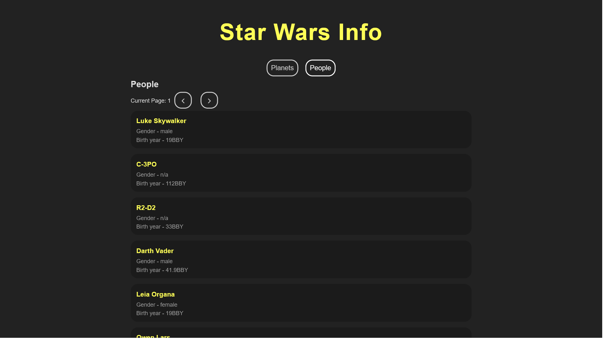

# Starwars - React Query & Router Practice

This is a simple practical application for practicing React Router and Ract-Query.
This Project was bootstrapped with [Vite](https://vitejs.dev/).

## Technologies

- HTML,CSS
- ES6
- React
- **react-router-dom** package for routing
- **ract-query**
- **ract-query-devtools** for easier development

## Features

- Showing planets and peaple data
- Paginating between different pages
- Nested Routs

## Installation

Install **Starwars** with npm

```shell
npm install

npm run dev
```

## Screenshots


